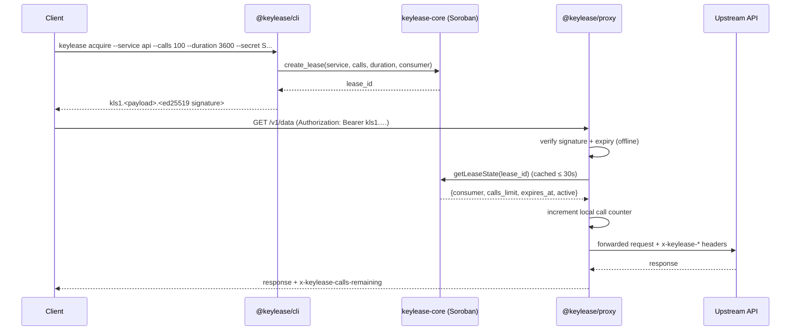

# keylease-gateway

[](https://github.com/KeyLease-Security/keylease-gateway/actions/workflows/ci.yml)
[](./LICENSE)
[](https://nodejs.org)
[](https://pnpm.io)
[](https://www.typescriptlang.org/)
[](https://soroban.stellar.org)

TypeScript workspace for **KeyLease**: a developer CLI that acquires API leases
on the Soroban `keylease-core` contract, and an edge reverse proxy that verifies
those leases before any request is allowed to reach a protected upstream API.

> On-chain half of the project: [**keylease-core**](https://github.com/KeyLease-Security/keylease-core)
> — the Soroban registry contract (`create_lease`, escrow, settlement) this CLI
> calls and the proxy reads lease state from.

```
packages/cli    →  @keylease/cli     keylease acquire / env / status
packages/proxy  →  @keylease/proxy   lease-verifying reverse proxy
```

---

## Architecture

```
 ┌──────────┐                              ┌─────────────────────────────┐
 │          │  1. keylease acquire          │                             │
 │          │  ──────────────────────────┐  │        @keylease/cli        │
 │          │                            ▼  │                             │
 │          │              ┌───────────────────────────┐                  │
 │ Client   │              │ 2. create_lease(...)      │                  │
 │ (dev /   │              │    @stellar/stellar-sdk   │                  │
 │  CI job) │              └────────────┬──────────────┘                  │
 │          │                           │ 3. sign (lease_id, consumer)    │
 │          │                           ▼                                 │
 │          │              ┌───────────────────────────┐                  │
 │          │              │ kls1.<payload>.<ed25519>  │  session token    │
 │          │              └────────────┬──────────────┘                  │
 └────┬─────┘                           │                                 │
      │                                 │        ┌───────────────────────┐ │
      │ 4. GET /v1/weather              │        │  keylease-core (WASM) │ │
      │    Authorization: Bearer <tok>  │        │  lease entry + quota  │ │
      │                                 │        └───────────▲───────────┘ │
      ▼                                 │                    │             │
 ┌────────────────────────────────────┐ │  6. lease state    │             │
 │        @keylease/proxy             │ │     (TTL-cached)   │             │
 │                                    ├─┴────────────────────┘             │
 │ 5. extract bearer token            │   Soroban RPC                     │
 │ 7. verify signature (offline)      │                                    │
 │ 8. verify lease on chain ──────────┼────────────────────────────────────┘
 │ 9. increment local call counter    │
 │10. forward request if allowed      │
 └───────────────┬────────────────────┘
                 │ 11. proxied request (lease header attached)
                 ▼
        ┌─────────────────┐
        │  Upstream API   │   ← never sees an unverified request
        └─────────────────┘
```



### Why it is shaped this way

- **The signature check is offline.** A bearer token is
  `kls1.<base64url(payload)>.<ed25519 signature>` where the payload carries
  `(v, lease_id, consumer, iat, exp)` and the signature is produced by the
  consumer's Stellar key. Forged or expired tokens never reach the RPC layer.
- **The lease check is on chain, but cached.** `verifier.ts` reads the lease
  from Soroban RPC and stores it in `cache.ts`, an in-memory TTL/LRU cache
  (default 30 s, configurable via `KEYLEASE_CACHE_TTL_MS`), so a busy proxy
  makes far fewer RPC calls than it handles requests.
- **Quota is enforced locally per proxy.** Each allowed request increments an
  in-memory call counter; the lease is refused with `403 quota_exhausted` once
  `max(on-chain calls_used, local count) >= calls_limit`.

---

## Quickstart

```bash
pnpm install
pnpm build

# 1. acquire a lease (needs a funded testnet account + a deployed keylease-core)
export KEYLEASE_CONTRACT_ID=C...
keylease acquire --service weather-api --calls 100 --duration 3600 --secret "$STELLAR_SECRET"

# 2. drop the session keys into ./.env
keylease env --service weather-api

# 3. run the proxy in front of the protected API
export KEYLEASE_UPSTREAM_URL=https://api.example.com
export KEYLEASE_CONTRACT_ID=C...
pnpm --filter @keylease/proxy start

# 4. call through it
curl -H "Authorization: Bearer $KEYLEASE_SESSION_TOKEN" http://localhost:8080/v1/weather
```

Offline sanity check of a token (no RPC required):

```bash
keylease status --token "$KEYLEASE_SESSION_TOKEN"
```

---

## CLI reference

| Command | Purpose |
| --- | --- |
| `keylease acquire --service <id> --calls <count> --duration <secs> --secret <key>` | Invokes `create_lease` on `keylease-core` and prints a signed session bearer token |
| `keylease env --service <id> [--file .env]` | Writes the temporary keys of an acquired lease into a local `.env` |
| `keylease status --lease <id>` | Reads live lease state over Soroban RPC |
| `keylease status --token <token>` | Verifies a session token offline |
| `keylease help` · `keylease --version` | Help / version |

Common flags: `--network testnet|mainnet|local`, `--rpc <url>`,
`--contract <id>`, `--json` (machine-readable output).

`--secret` is the consumer account's **Stellar secret seed**. It signs both the
`create_lease` transaction and the session token, and it never leaves the
process — it is not printed, logged, or written to disk.

`acquire` remembers the lease in `.keylease/sessions.json` (git-ignored) so
`env` can find it later. `env` merges these keys, replacing existing ones and
preserving everything else in the file:

```
KEYLEASE_SERVICE KEYLEASE_LEASE_ID KEYLEASE_CONSUMER KEYLEASE_SESSION_TOKEN
KEYLEASE_CALLS_LIMIT KEYLEASE_ISSUED_AT KEYLEASE_EXPIRES_AT
```

## Proxy configuration

| Variable | Required | Default | Description |
| --- | --- | --- | --- |
| `KEYLEASE_UPSTREAM_URL` | yes | – | Protected API base URL (path prefixes are preserved) |
| `KEYLEASE_CONTRACT_ID` | yes | – | `keylease-core` contract id |
| `KEYLEASE_NETWORK` | no | `testnet` | `testnet` \| `mainnet` \| `local` |
| `KEYLEASE_RPC_URL` | no | network default | Soroban RPC endpoint override |
| `KEYLEASE_CACHE_TTL_MS` | no | `30000` | Lease-state cache TTL |
| `KEYLEASE_FORWARD_AUTH` | no | `false` | Forward the caller's bearer token upstream |
| `PORT` / `HOST` | no | `8080` / `0.0.0.0` | Listen address |

### Responses

| Status | Meaning |
| --- | --- |
| `401 missing_token` / `invalid_token` / `token_expired` | Bearer token absent, malformed, forged or expired |
| `403 lease_not_found` / `lease_inactive` / `lease_expired` / `consumer_mismatch` | On-chain lease does not permit this call |
| `403 quota_exhausted` | The lease's call limit has been spent |
| `503 verification_unavailable` | Soroban RPC could not be reached (fail closed) |
| `502 bad_gateway` / `504 gateway_timeout` | Upstream failure (only after the lease passed) |

Allowed responses carry `x-keylease-lease-id` and `x-keylease-calls-remaining`.

---

## Deployments

Nothing in this project holds mainnet value until an audit is announced (see
[SECURITY.md](./SECURITY.md)). Current deployment status:

| Component | Network / host | Address or URL |
| --- | --- | --- |
| `keylease-core` registry contract | Stellar Testnet | [`CC7BTFSJHYCRYQSMERO6E4VW3DPKTDEBP4YRCFJ5GS54JOMA4VRF45OT`](https://stellar.expert/explorer/testnet/contract/CC7BTFSJHYCRYQSMERO6E4VW3DPKTDEBP4YRCFJ5GS54JOMA4VRF45OT) — service `1` registered; escrow token (native SAC) `CDLZFC3SYJYDZT7K67VZ75HPJVIEUVNIXF47ZG2FB2RMQQVU2HHGCYSC` |
| Reference `@keylease/proxy` instance | – | Not hosted yet — run locally per [Quickstart](#quickstart) |
| `@keylease/cli` | npm registry | Not published (`@keylease` scope) — install from source per [Development](#development) |

How each row gets filled:

1. **Contract** — build and deploy per the
   [keylease-core Quickstart](https://github.com/KeyLease-Security/keylease-core#quickstart):
   `cargo build --target wasm32v1-none --release`, then
   `stellar contract deploy --network testnet`, then `init` / `set_token`.
   The `C...` ID lands here, in the release notes, and in `KEYLEASE_CONTRACT_ID`.
2. **Proxy** — any long-running Node host (Render, Fly.io, Railway, a VM):
   `pnpm install && pnpm --filter @keylease/proxy start` with
   `KEYLEASE_UPSTREAM_URL`, `KEYLEASE_CONTRACT_ID` and (for testnet)
   `KEYLEASE_RPC_URL` set. The public base URL lands here plus a demo `curl`
   that returns `x-keylease-calls-remaining`.
3. **CLI** — `npm publish` under the `@keylease` scope; until then install
   from source.

## Repository layout

```
keylease-gateway/
├── .github/
│   ├── workflows/ci.yml               # lint → build → tsc --noEmit → test
│   ├── ISSUE_TEMPLATE/                # issue templates: trivial (100) / medium (150) / high (200)
│   └── pull_request_template.md
├── packages/
│   ├── cli/                           # @keylease/cli
│   │   └── src/{index,token}.ts
│   │       ├── commands/{lease,status}.ts
│   │       └── client/soroban.ts
│   └── proxy/                         # @keylease/proxy
│       └── src/{index,server,verifier,cache}.ts
├── package.json                       # pnpm scripts: build / test / lint / typecheck
├── pnpm-workspace.yaml
├── tsconfig.base.json
├── LICENSE (MIT)
├── README.md
└── CONTRIBUTING.md
```

## Development

```bash
pnpm build         # tsc emit for both packages (topological order)
pnpm test          # vitest: 48 CLI tests + 46 proxy tests
pnpm lint          # eslint (flat config, typescript-eslint)
pnpm typecheck     # build, then tsc --noEmit in every package
```

Tests never touch the network: the CLI injects a fake `SorobanRpc` client, and
the proxy injects a fake `LeaseStateProvider`, a fake `fetch` and a fake clock.

### Contract schema used by this repo

`create_lease(service: string, calls: u32, duration: u32, consumer: Address) -> string`

Lease entry stored under `Vec[Symbol("lease"), String(lease_id)]`:

```
service: String, consumer: Address, calls_limit: U32,
calls_used: U32, expires_at: U64 (unix seconds), active: Bool
```

## Contributing

PRs welcome — read [CONTRIBUTING.md](./CONTRIBUTING.md) for setup, coding
conventions and the issue templates (trivial 100 / medium 150 / high 200
points). Found a security issue (token forgery, quota bypass, RPC spoofing)?
Follow [SECURITY.md](./SECURITY.md) instead of opening a public issue.

## Community

Questions, ideas, or just want to follow along? Open a
[GitHub issue](https://github.com/KeyLease-Security/keylease-gateway/issues) —
everything is tracked in the open.

## Maintainers

| Maintainer | Role | Contact |
| --- | --- | --- |
| [KeyLease-Security](https://github.com/KeyLease-Security) | Project owner | [GitHub issues](https://github.com/KeyLease-Security/keylease-gateway/issues) |

## Contributors

<a href="https://github.com/KeyLease-Security/keylease-gateway/graphs/contributors">
  
</a>

## License

[MIT](./LICENSE)
